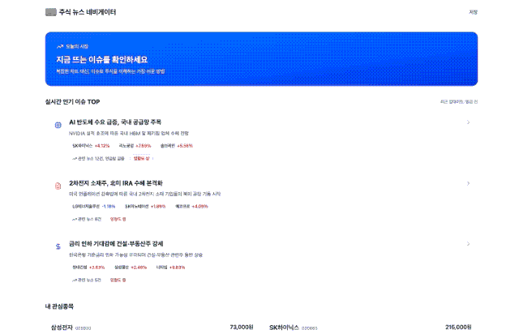

# Stock-Lens
이슈를 통해 주식 흐름을 이해하는 **주식 뉴스 네비게이터**입니다.

## 0. 서비스 개요와 목적
### 서비스 목표
- 시장 이슈와 연관 지어 주식 정보를 빠르게 훑어볼 수 있는 서비스
- 주식 초보가 쉽게 시장 트렌드와 주식을 연관지어 이해할 수 있는 서비스

### 개인 목표
- Vite + React 환경에서 프로젝트 구현
- 아키텍처(FSD), 상태 관리, 라우팅, **모달 딥링크, 무한 스크롤** 실험

## 1. Tech Stack
- Core: React, Vite, TypeScript
- Routing: React Router
- Styling: Tailwind CSS, MUI Icon
- Mock: MSW
- Formatting: Prettier
- Architecture: Feature-Sliced Design(FSD)
- Data layer: (진행 중) fetch → axios → TanStack Query

## 2. Demo


## 3. Roadmap / TODO (✅ 완료 / 🟡 진행중 / ⬜ 예정)

### Foundation
- ✅ FSD 폴더 구조 만들기
- ✅ 라우터 연결(React Router)
- 🟡 컴포넌트 제작 및 조합하여 페이지 구성하기
- ✅ 스타일 마이그레이션 (styled-components → Tailwind CSS)
- ✅ MSW 서버에 목데이터 만들기

### MVP
- 🟡 MSW 기반 데이터 연결 및 화면 구현(리스트/상세 흐름)
- ⬜ 뉴스 상세 모달 구현 `?newsId=...`
  - ⬜ 뒤로가기/공유(딥링크) 시 상태 유지
- ⬜ 스낵바 구현(에러/성공 피드백)
- ⬜ 무한스크롤 구현(홈/뉴스/타임라인 중 우선순위 1개부터)

### Nice to have
- ⬜ 뉴스 크롤링(정책/운영 이슈 고려 필요)
- ⬜ 뉴스 AI 요약(비용/품질/출처 문제 고려 필요)
- ⬜ 주식 차트 핸들링(차트 라이브러리/성능 이슈 포함)

## 4. Project Structure (FSD)
```txt
src/
  features/    # 전체를 기능 단위로 분류
    app/        # 앱 관련 기능 (Provider, Router 엔트리 등)
    Issues/     # Issue 관련 컴포넌트 파일
    layout/     # Layout 관련 파일 (MainLayout, Header 등)
    pages/      # 라우트 단위 페이지
    shared/     # 공용(UI, styles)
    Stocks/     # Stocks 관련 컴포넌트 파일
    types/      # typescript 정의 파일
  mocks/       # msw 목데이터
```

## 5. Getting Started

### Requirements
- Node.js / pnpm

### Install & Run
```
pnpm install
pnpm run dev
```
- 브라우저: http://localhost:5173/

## 6. Scripts
```
pnpm run dev
pnpm run build
pnpm run preview
```

## 7. 기록 (velog) - 연재 중, 작성 후 링크 연결 예정
#### 왕초보 프론트의 프로젝트 제작기 (React + TS)

1. [삐약 개발자의 첫 개인 프로젝트 만들기 (React + TS)
](https://velog.io/@jjipper/stock-lens-1)
2. 무에서 유를 만들 땐 폴더 구조부터 정하자 (FSD)
3. 스타일링 선택 기록: CSS, SCSS, styled-components, Tailwind 비교
4. 내 노트북에선 멀쩡한 게 왜 거기선 깨지지? 폰트 FOUT 현상 추적기
5. 진짜 어려운 TypeScript 돌파하기: 프로젝트에서 바로 쓰는 타입 기초
6. React Router로 레이아웃 잡기: 중첩 라우트와 Outlet
7. History API로 이해하는 라우팅: 뒤로가기/딥링크가 꼬이는 이유
8. MSW로 서버 흉내 내기: JSON Server와 비교하며 목데이터 파이프라인 만들기
9. fetch로 시작해서 구조화로 넘어가기: 에러/로딩/중복 요청/취소(Abort)
10. ...
<!-- 11. “Fallback”을 어디에 둘까: 로딩/에러/빈 상태 UI를 일관되게 만들기
1.  입력 UX 디테일: isComposing으로 한글 입력 버그 피하기
2.  전역 상태를 어디까지 둘까: Context API와 서버 상태(캐시) 분리 기준
3.  axios + TanStack Query로 데이터 레이어 고정하기: queryKey 설계와 무효화 전략
4.  가독성 좋은 파일 구성 실험: Public API, index(barrel) 사용 기준 세우기
5.  URL이 모달을 연다: ?newsId= 딥링크 모달, 뒤로가기, 스크롤 락
6.  무한 스크롤 실전: 경계 조건, 중복 데이터, 스크롤 위치 유지
7.  사용자 피드백을 UI로: 스낵바/에러 UX를 어디서 어떻게 보여줄까
8.  회고 -->